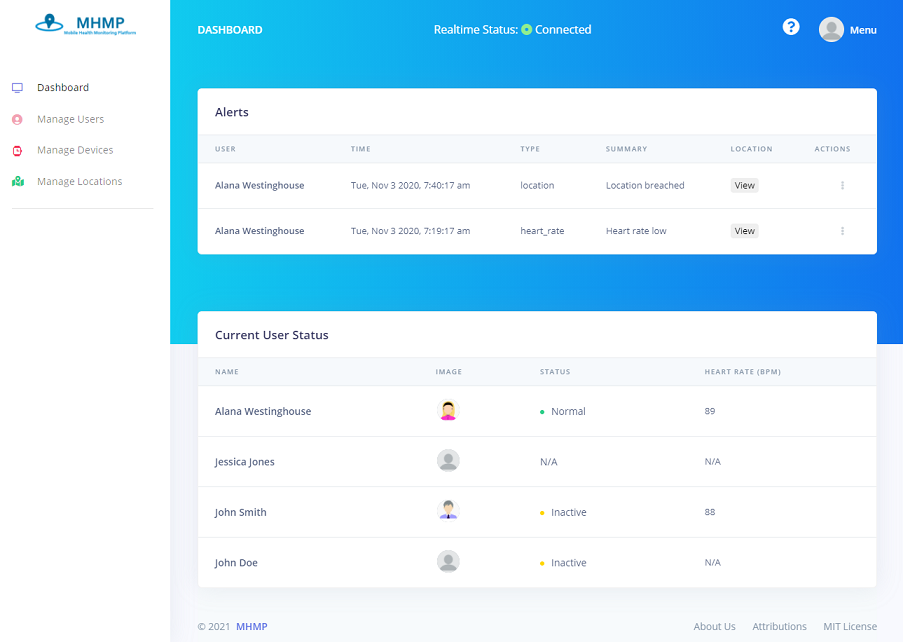

# MHMP Front-End Dashboard User's Guide
This user guide contains a brief tutorial to get you started using the provided MHMP frontend dashboard. 

---

## Logging In and Account Creation

1. When first opening the application, you will be greeted with the login screen powered by Amazon Cognito. Please click **Create account** if you have not yet created one.

2. Please fill out the *Username* field with your email address. This is the username you will need to login. Fill out the rest of the form then click **CREATE ACCOUNT**.

3. You should then receive a verification code delivered to the email address you selected. Please note that it could take up to a few minutes to recieve this verification code. Once received, enter the verification code and click **CONFIRM**.

---

## UI
After logging in, the system will fetch required data from the backend after which you will be greeted with the dashboard's homepage. This page contains two tables. The top one containing alerts with details and a location finder. The bottom table contains a list of all users with real-time status updates and heart rates.  

### Alerts
Alerts can be dismissed by clicking on the actions tab and clicking **Marked As Resolved**. This not only deletes the alert, but it resets the user's status to normal. This is important because once a heart rate or location alert is received, no new alerts will be generated until the status of the user is cleared. 

A map view of the user's location at the time the alert was generated can be viewed by clicking **View** in an alert entry. 

Additionally, an alert notification will appear on the left sidebar. This sidebar is persistant on any page of the application so that the admin user can be notified of new alerts no matter where they are in the application.

#### Real-time Alert Subscription Status
The *Realtime Status* at the top of the dashboard indicates that the real-time alert system is functioning correctly if it is green and displays *Connected*. Disruptions such as an internet connection loss will result in the real-time alert system (subscription) being cancelled. This will be indicated by the *Realtime Status* displaying a red dot and a *Disconnected* message. Please check your internet connection and refresh the application to troubleshoot and re-establish the real-time connection.

---

## User Management
Clicking on the *Manage Users* button from the left-hand navigation bar will take you to the user management page.

### Registering a User

From here, you'll find a link to register a new user in the system. For user registration, first and last names are required fields, all others are optional. 

### User Profile
Once you've registered the new user, you can view their profile by clicking on the appropriate actions tab and selecting *View Profile*. 

From the user's profile page, you can edit their personal information by clicking **Edit Profile**. After making changes, ensure that you click the **Save Changes** button to save your update. Youy can also find the user's real-time location on a map by clicking **Locate User** from the right-hand panel. 

### Data Visualization
You can view a graph of the patient's historical heart rate data over the last one hour period by clicking **View Data**. This functionality can be extended to other data types (eg. O2 levels) if desired but currently only heart rate visualization has been implemented. 

### Deleting a User
You can also delete a user by clicking **Delete User** from either the user's profile page or from the *Actions* tab in the User Management page. Please ensure that you have unpaired any device associated with the user before attempting a deletion. You will be blocked from deleting a user if they have a device paired to them.

---

## Device Management
Clicking on the *Manage Devices* button from the left-hand navigation bar will take you to the device management page.

### Registering a Device
Devices can be registered manually or automatically. By clicking **Register a Device**, the unique Device ID that corresponds to the wearable device should be inputted. This information can be found after installing the companion application onto the wearable device. Alternatively, once the moblile device is set-up and starts sending data to the AWS IoT Core, it will be registered automatically if it hasn't been registered already.

Once a device is registered, the device status will be set to *Inactive* if registered manually, or *Ready* if registered automatically. More information on the function of the device status can be found below.

### Device Status
The device status is synonymous with the "status" of users displayed on the dashboard's homepage. This provides important information about the state of the device or its user.
The following is a breakdown of the possible device states:
  - Ready: The device has been registered and is actively sending data.
  - Inactive: The device has not sent data in the past hour. This could possbily indicate a malfunction or depleted battery if the device is currently set-up correctly and         paired with a user.
  - Normal: The device is actively sending data.
  - Location_Anomaly: A location anomaly has been detected for the user associated with the device. No new location alerts will be dispatched until the device status has been cleared manually (marking an lert as resolved from the dashboard). 
  - HeartRate_Anomaly: A heart rate anomaly has been detected for the user associated with the device. No new heart rate or location alerts will be dispatched until the device status has been cleared. Please note that heart rate alerts have been given priority over location based alerts.

